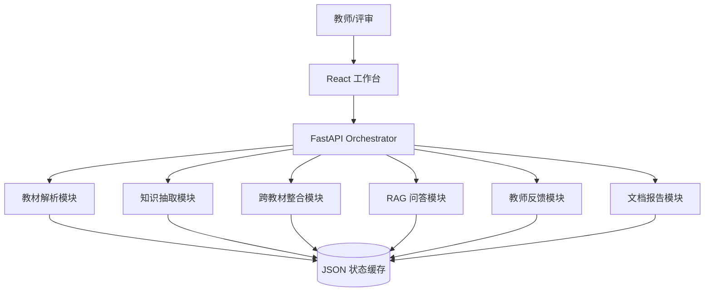

# Agent 架构说明

## 架构总览

首版采用“模块化单 Agent 编排”架构：用户通过 Web 触发任务，后端由一个 Orchestrator API 顺序调用解析、图谱、整合、RAG、反馈和报告模块。

## 设计决策

选择单 Agent 编排而不是多 Agent，是因为黑客松首版更需要稳定闭环和可调试性：

- 上传、解析、图谱、整合、RAG 的数据依赖强，单编排能减少跨 Agent 状态不一致。
- 当前代码规模小，模块边界已经能控制复杂度。
- LLM 调用集中在知识抽取和 RAG 生成，Prompt 数量可控。

模块边界如下：

- Parser：只负责文件转章节结构。
- Graph Builder：只负责知识点和关系抽取。
- Integration：只负责 merge/keep/remove 决策和压缩统计。
- RAG：只负责分块、检索、回答和引用。
- Feedback：只负责根据教师反馈覆盖决策。

## 数据流与调用链路

完整流程：

1. `POST /api/textbooks/upload` 保存文件并解析章节。
2. `POST /api/graphs/build` 对已解析教材构建单本图谱。
3. `POST /api/integration/run` 对全部图谱做去重和压缩。
4. `POST /api/rag/index` 建立 chunk 索引。
5. `POST /api/rag/query` 检索 top-5 chunk，生成带引用回答。
6. `POST /api/integration/feedback` 根据教师反馈覆盖决策。
7. `GET /api/report/integration` 生成整合报告。

## Prompt 工程

知识抽取 Prompt 要求：

- 只输出 JSON。
- 限定关系类型为 prerequisite、parallel、contains、applies_to。
- 每次只处理一个章节。
- 节点必须包含名称、定义、类别、页码、原文短句。

RAG Prompt 要求：

- 只基于上下文回答。
- 每个关键结论带来源引用。
- 未找到证据时回复“当前知识库中未找到相关信息”。

## 取舍与权衡

- 暂不引入数据库，减少部署和迁移成本。
- 暂不下载大型 embedding 模型，首版用 TF-IDF + BM25 保证可运行。
- LLM 调用失败时使用启发式兜底，牺牲部分精度换取演示稳定性。
- 前端必须使用 `frontend-design` skill，定位为医学教研工作台，而不是普通模板页。

## 已知局限

- PDF 章节识别依赖文本层和标题模式，复杂扫描版教材需要 OCR 才能提升效果。
- 同义词对齐首版依赖字符相似度和有限别名，跨语言医学术语仍需更强 embedding 或词表。
- 教师反馈首版以规则匹配为主，后续可让 LLM 解析反馈意图并精确修改图谱。

## 创新点

- 把整合决策、压缩比、图谱节点频次、RAG 引用放在同一个操作工作台中，便于教师连续审阅。
- 所有生成结果保留教材、章节、页码元数据，便于追溯。

