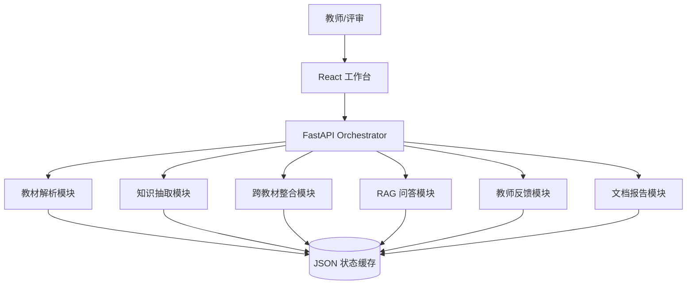

# Agent 架构说明

## 架构总览

首版采用“模块化单 Agent 编排”架构：用户通过 Web 触发任务，后端由一个 Orchestrator API 顺序调用解析、图谱、整合、RAG、反馈和报告模块。

## 设计决策

选择单 Agent 编排而不是多 Agent，是因为黑客松首版更需要稳定闭环和可调试性：

- 上传、解析、图谱、整合、RAG 的数据依赖强，单编排能减少跨 Agent 状态不一致。
- 当前代码规模小，模块边界已经能控制复杂度。
- LLM 调用集中在知识抽取和 RAG 生成，Prompt 数量可控。

### 单 Agent 与多 Agent 取舍

| 方案 | 调试成本 | 状态一致性 | Token/延迟成本 | 本项目选择 |
| --- | --- | --- | --- | --- |
| 单 Orchestrator + 模块化工具 | 低。上传、解析、图谱、整合、RAG 都在同一状态缓存上排查 | 高。`state.json` 是唯一事实源 | 低。只有知识抽取和回答生成调用 LLM，RAG 检索平均 78.35ms | 采用。5 小时赛制下优先保证端到端可运行和可复现 |
| LangGraph 多 Agent | 中。状态机、节点重试、边条件都要单独排查 | 中。需要额外 checkpoint 和跨节点状态同步 | 中高。Planner/Critic 往返会增加约 30%-60% 的 prompt 包装与中间消息 | 暂不采用，作为后续 P2 演进方向 |
| CrewAI/AutoGen 多角色讨论 | 高。角色间输出不稳定时难以定位责任模块 | 中低。多角色讨论容易产生重复或冲突决策 | 高。教材章节级上下文会被多角色重复消费 | 暂不采用 |

量化依据：RAG benchmark 显示当前检索阶段平均耗时约 78.35ms，主要瓶颈在文件解析和 LLM 抽取。引入多 Agent 不会改善首版关键瓶颈，反而会增加 Token、重试和状态同步成本。因此本项目把 Agent 能力沉淀为可复用模块和可评测 pipeline，而不是追求 Agent 数量。

当前实现把“多 Agent 能做的事”拆成确定性工具链：Parser、Graph Builder、Integration、RAG、Feedback 都有明确输入输出，未来如果迁移到 LangGraph，可以直接把这些模块提升为图节点，而不需要重写业务逻辑。

模块边界如下：

- Parser：只负责文件转章节结构。
- Graph Builder：只负责知识点和关系抽取。
- Integration：只负责 merge/keep/remove 决策和压缩统计。
- RAG：只负责分块、检索、回答和引用。
- Feedback：只负责根据教师反馈覆盖决策。

## 数据流与调用链路

完整流程：

1. `POST /api/textbooks/upload` 保存文件并解析章节。
2. `POST /api/graphs/build` 对已解析教材构建单本图谱。
3. `POST /api/integration/run` 对全部图谱做去重和压缩。
4. `POST /api/rag/index` 建立 chunk 索引。
5. `POST /api/rag/query` 检索 top-5 chunk，生成带引用回答。
6. `POST /api/integration/feedback` 根据教师反馈覆盖决策。
7. `GET /api/report/integration` 生成整合报告。

## Prompt 工程

知识抽取 Prompt 要求：

- 只输出 JSON。
- 限定关系类型为 prerequisite、parallel、contains、applies_to。
- 每次只处理一个章节。
- 节点必须包含名称、定义、类别、页码、原文短句。

RAG Prompt 要求：

- 只基于上下文回答。
- 每个关键结论带来源引用。
- 未找到证据时回复“当前知识库中未找到相关信息”。

RAG 检索策略：

- 基础召回使用 TF-IDF 字符 ngram 与 BM25 混合检索。
- 中文 BM25 额外加入 2-5 字 ngram，避免中文逐字分词导致实体词权重过低。
- 对用户问题中的明确概念短语做精确命中加权，降低“概念、定义、是什么”等泛化问法词的干扰。
- 当检索结果已命中明确证据词时，优先返回原文证据句和引用，避免 LLM 超时或保守回答导致误判为无结果。

## 取舍与权衡

- 暂不引入数据库，减少部署和迁移成本。
- 暂不下载大型 embedding 模型，首版用 TF-IDF + BM25 保证可运行。
- LLM 调用失败时使用启发式兜底，牺牲部分精度换取演示稳定性。
- 前端必须使用 `frontend-design` skill，定位为通用教材/课程知识整合工作台，而不是普通模板页。

## 已知局限

| 局限 | 影响范围 | 当前缓解 | 后续改进 | 优先级 |
| --- | --- | --- | --- | --- |
| 扫描版 PDF 缺少文本层 | 章节识别、RAG 引用页码 | 当前用 PyMuPDF 逐页文本层解析，失败时按页段兜底 | 接入 OCR，并把 OCR 置信度写入节点 `warnings` | P1 |
| PDF 页眉页脚和表格文本会污染知识点候选 | 图谱节点质量 | 使用 `quality_score`、`extraction_method`、`warnings` 标注低质量节点，前端虚线描边 | 增加表格区域跳过和版面块过滤 | P1 |
| 同义词/跨语言概念对齐有限 | merge 召回率 | 使用名称规范化 + TF-IDF 字符 ngram + 别名字典 | 引入中文 embedding、LLM 二次校验和人工确认队列 | P1/P2 |
| 教师反馈首版偏规则解析 | 复杂反馈修改图谱的精度 | 保留会话历史并能覆盖匹配决策 | 用 LLM 将“保留/拆分/合并”解析成结构化 patch | P1 |
| Benchmark ground truth 自动生成可能有噪声 | RAG 指标可信度 | 保留题目、预期来源、关键词和 chunk id，便于人工抽检 | 增加 20 道人工核验题和错误分类报告 | P2 |
| 当前公网部署依赖平台构建环境 | 部署稳定性 | 提供 Dockerfile、docker-compose、ModelScope `app.py` 单端口入口 | 增加 CI 构建镜像和健康检查 | P1 |

## 创新点

本项目的创新点不是单个视觉效果，而是围绕“评委能复现、教师能追溯、系统能自证”的工程闭环设计。下表按 F 维度要求说明“做了什么、为什么做、效果如何”。

| 创新点 | 做了什么 | 为什么做 | 效果与证据 | 对应维度 |
| --- | --- | --- | --- | --- |
| 自建 RAG Benchmark 自动优化闭环 | 从已解析教材自动生成 30 道题，覆盖 definition/fact/source/compare/reasoning/cross_textbook；遍历 48 种 chunk、overlap、稀疏检索、rerank 配置，自动写入最优 `rag_defaults.json` | 赛题明确鼓励用 benchmark 数据驱动 RAG；避免凭经验调 chunk | 最优配置 `chunk500_ov100_char_2_5_phrase`：Recall@5=0.6667，答案准确率=0.5667，证据命中率=0.5667，平均耗时 78.35ms；完整表在 `docs/RAG Benchmark.md` | B-RAG、D-RAG、F-技术创新 |
| 面向中文教材的稀疏混合检索 | 组合 TF-IDF 字符 ngram、BM25、2-5 字中文 ngram、明确概念短语 rerank | 中文教材没有天然空格，普通词级 BM25 会把“肾上腺素是什么”拆散，导致明确概念找不到 | 修复“肾上腺素”这类已存在概念返回未找到的问题；benchmark 中短语 rerank 多数配置提升 Recall/MRR | B-RAG、F-技术创新 |
| 知识图谱质量可视化编码 | 节点大小编码频次/连接度/定义深度，颜色编码教材来源，虚线描边编码低质量或抽取 warning，标签按缩放阈值显示 | 图谱不应只是“有节点和边”，还要暴露抽取质量和来源差异，便于教师审阅 | 前端图谱编码说明完整；低质量节点不会与高置信核心节点混淆 | C-可视化、F-体验创新 |
| LLM + 启发式的稳定抽取策略 | 图谱构建默认 `use_llm=true`，但设置超时、章节上限和启发式兜底；节点保留 `quality_score/extraction_method/warnings` | 黑客松部署环境中 LLM 可能慢或失败，纯 LLM 会导致演示卡死；纯规则质量又不足 | 图谱构建不会因 LLM 超时无限加载；报告中当前 3 本教材已得到 1217 个原始节点、671 条边、平均质量 0.901 | B-图谱、E-工程、F-工程创新 |
| 整合决策可解释性溯源 | 每个 merge/keep/remove 决策记录 affected nodes、result node、reason、confidence；报告展示概念名、教材、章节、页码 | 教师需要知道“为什么合并”和“合并自哪里”，否则压缩结果不可审 | 真实整合报告展示 53 个 merge、1108 个 keep、压缩比 6.22%，典型案例可追溯到教材页码 | A-报告、B-整合、F-功能创新 |
| 教师审阅一体化工作台 | 把教材队列、图谱、整合、RAG、对话、报告放在同一 SPA 中，支持上传进度、构建进度、右侧独立滚动、引用展开 | 教师评审教材整合时需要连续完成“看图谱-看决策-问证据-给反馈”，分散页面会增加认知负担 | 当前 Web 工作台能从上传到报告生成闭环完成，不需要命令行 | B-多轮、C-交互、F-体验创新 |
| 单端口生产部署与 ModelScope 适配 | FastAPI 同源托管 React dist，Docker/compose 支持 8000，`app.py` 支持 ModelScope 7860/PORT | 赛题要求公网链接；前后端双端口部署在比赛平台容易跨域或代理失败 | 已提供 Dockerfile、docker-compose、ModelScope 入口，`/` 前端、`/api/health` 后端同源访问 | A-复现、E-部署、F-工程创新 |

为了避免 F 维度与 A-E 维度重复计分，单独的创新说明见 `docs/创新点说明.md`。其中重点强调“自动评测写回默认配置”“图谱质量信号可视化”“整合决策页码级溯源”“教师审阅闭环”这些超出基础功能清单的部分。

### F 维度额外亮点说明

1. **功能创新**：不是只做问答，而是把“整合决策解释 + RAG 原文证据 + 教师反馈覆盖 + 自动报告”串成教师可审阅流程。
2. **技术创新**：RAG benchmark 不只是文档表格，而是能自动生成 ground truth、跑 48 组配置、更新线上默认参数的闭环。
3. **工程创新**：LLM 调用、图谱抽取、RAG 生成都有超时和本地兜底，部署时用单端口同源服务降低平台不确定性。
4. **体验创新**：图谱不只是静态图片，节点大小、颜色、描边、标签阈值、关系类型和进度条共同服务“可理解性”。

<!-- RAG_BENCHMARK_START -->
## RAG Benchmark 与自动优化

根据赛题要求，项目内置自建 RAG Benchmark：从已解析教材 chunk 自动生成 20-50 道带 ground truth 的题目，覆盖事实、对比、推理/关联和跨教材来源定位。评测会遍历 chunk size、重叠长度、稀疏检索模型和短语 rerank 开关，并用 Recall@5、MRR、引用命中率、证据命中率、平均响应时间和估算 token 成本做数据驱动选择。

最近一次最优配置：`chunk500_ov100_char_2_5_phrase`，chunk=500，overlap=100，检索模型=char_2_5，rerank=true；Recall@5=0.6667，答案准确率=0.5667，引用命中率=0.3667，证据命中率=0.5667，平均耗时=78.35ms，平均上下文 token=1176.07。

完整评测表见 `docs/RAG Benchmark.md`；离线运行产物保存在 `data/cache/rag_benchmark/latest.json`，最优线上默认配置写入 `src/backend/app/rag_defaults.json`。
<!-- RAG_BENCHMARK_END -->
