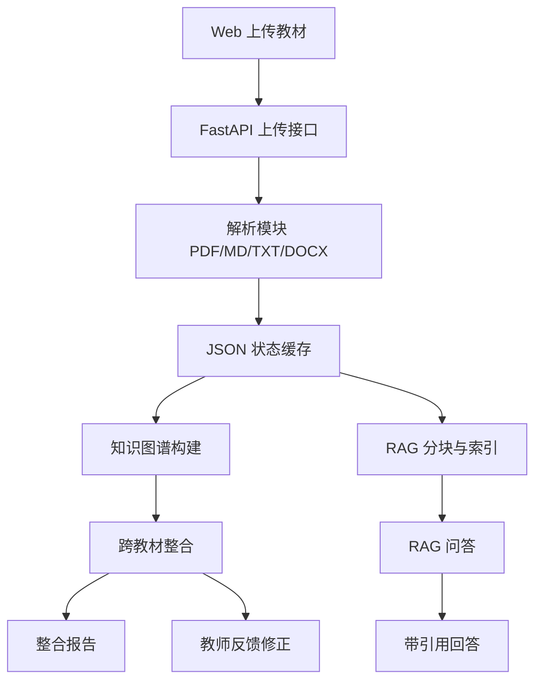

# 系统设计

## 架构图

## 技术选型

- 后端：FastAPI，接口轻量，便于本地和云端部署。
- 解析：PyMuPDF 逐页解析 PDF，python-docx 解析 DOCX。
- LLM：OpenAI-compatible Chat API，配置从 `.env` 的 `LLM_*` 变量读取，具体供应商可替换。
- 图谱：后端输出节点/边 JSON，前端用 ECharts graph 渲染。
- 检索：TF-IDF + BM25 首版混合检索，保留后续替换 embedding 的接口空间。
- 存储：首版用 `data/cache/state.json` 持久化，降低数据库配置成本。

## 数据流

1. 上传文件后保存到 `data/uploads/`。
2. 解析模块生成 `Textbook -> Chapter[]`，写入状态缓存。
3. 图谱构建模块从章节提取 `KnowledgeNode` 和 `GraphEdge`。
4. 整合模块合并所有图谱，输出 `IntegrationDecision` 和整合后图谱。
5. RAG 模块从章节切 chunk，查询时检索 top-5 并调用 LLM 生成带引用回答。
6. 报告模块根据当前状态写入 `report/整合报告.md`。

## 评分与创新映射

| 评分维度 | 系统设计对应点 |
| --- | --- |
| A 文档完整性 | README、需求分析、系统设计、Agent 架构说明、接口文档、整合报告齐全；Docker/ModelScope 单端口部署说明可复现 |
| B 功能完整度 | PDF/MD/TXT/DOCX 解析、LLM+兜底图谱构建、跨教材 merge/keep/remove、RAG 引用问答、教师反馈会话 |
| C 可视化创新 | ECharts 图谱叠加大小、来源色、质量 warning、关系类型线型和缩放标签阈值 |
| D Agent 架构 | 单 Orchestrator + 模块化工具，RAG benchmark 为架构决策提供量化证据 |
| E 代码质量 | 前后端分离、Pydantic schema、provider-neutral LLM 配置、部署入口和测试覆盖 |
| F 创新自由发挥 | 自建 RAG Benchmark 自动优化、中文混合检索、整合决策可解释性溯源、教师审阅一体化工作台、单端口公网部署 |

F 维度的完整说明见 `docs/创新点说明.md`，核心目标是让创新点具备可验证的工程证据，而不是只停留在功能描述。

## 接口一览

- `POST /api/textbooks/upload`
- `GET /api/textbooks`
- `GET /api/textbooks/{textbook_id}`
- `POST /api/graphs/build`
- `GET /api/graphs/{textbook_id}`
- `POST /api/integration/run`
- `GET /api/integration/decisions`
- `POST /api/integration/feedback`
- `POST /api/rag/index`
- `GET /api/rag/status`
- `POST /api/rag/query`
- `GET /api/report/integration`
