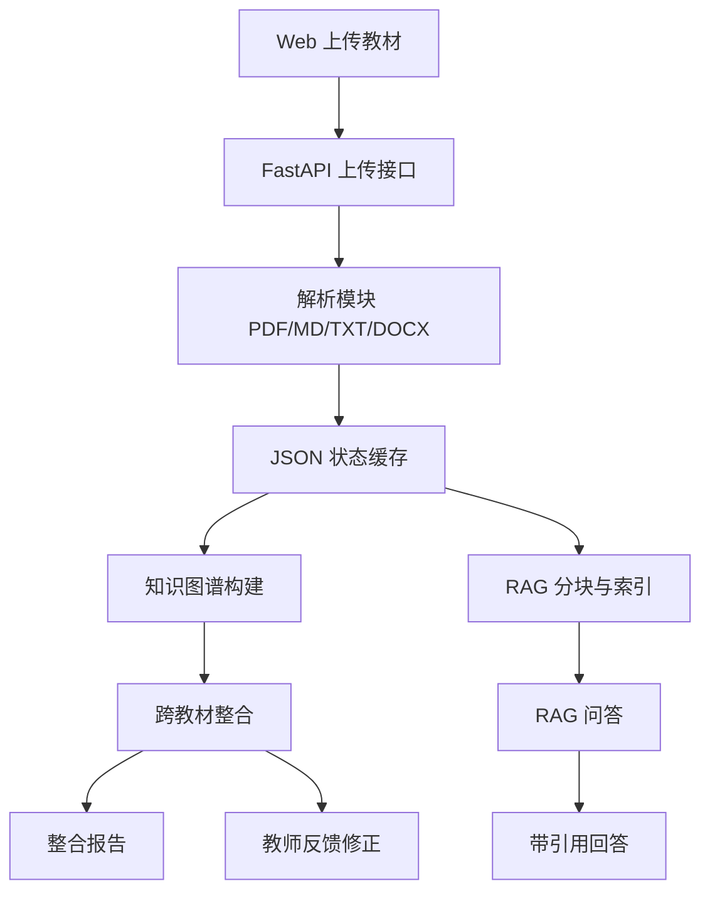

# 系统设计

## 架构图

## 技术选型

- 后端：FastAPI，接口轻量，便于本地和云端部署。
- 解析：PyMuPDF 逐页解析 PDF，python-docx 解析 DOCX。
- LLM：DeepSeek OpenAI-compatible Chat API，配置从 `.env` 读取。
- 图谱：后端输出节点/边 JSON，前端用 ECharts graph 渲染。
- 检索：TF-IDF + BM25 首版混合检索，保留后续替换 embedding 的接口空间。
- 存储：首版用 `data/cache/state.json` 持久化，降低数据库配置成本。

## 数据流

1. 上传文件后保存到 `data/uploads/`。
2. 解析模块生成 `Textbook -> Chapter[]`，写入状态缓存。
3. 图谱构建模块从章节提取 `KnowledgeNode` 和 `GraphEdge`。
4. 整合模块合并所有图谱，输出 `IntegrationDecision` 和整合后图谱。
5. RAG 模块从章节切 chunk，查询时检索 top-5 并调用 LLM 生成带引用回答。
6. 报告模块根据当前状态写入 `report/整合报告.md`。

## 接口一览

- `POST /api/textbooks/upload`
- `GET /api/textbooks`
- `GET /api/textbooks/{textbook_id}`
- `POST /api/graphs/build`
- `GET /api/graphs/{textbook_id}`
- `POST /api/integration/run`
- `GET /api/integration/decisions`
- `POST /api/integration/feedback`
- `POST /api/rag/index`
- `GET /api/rag/status`
- `POST /api/rag/query`
- `GET /api/report/integration`

